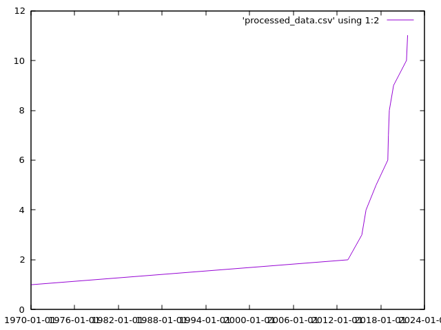

So I tried to run the ecosystem project and I would say that it is really nice tool to generate visuals for json-schema. And the main thing I liked about it was that we were doing two calls to github and checking their initial commits like if they have json schema or not. But I have notice that if we hit the last commit we will mostly get the github Default commit if the user used github ui to make the project so "Initial Commit" would hold only readme file and .gitignore file. So in that case we will never know that this project is early adopter of json-schema. I have idea to fix this also. But let me address other issue it's not related to the project but it's related to DX(Developer Exp)

I know this is just a POC but if i had to fix few thing I would fix the README.md first.
I would mention which Node version is compatible and what python packages are needed for it to run properly like csvKit, gnuplot
Than what package manager should be used with this like pnpm 

After figuring out all this stuff when I did npm start it throws error of not having any directory named data. So I would handle this also and create a directory for the developer

Before 
#createFile() {
    if (!fs.existsSync(this.fileName)) {
        const headerLine = `${this.columns.join(',')}\n`;
        fs.writeFileSync(this.fileName, headerLine, 'utf8')  // ← crashes if data/ doesn't exist
    }
}

After
import path from 'path' 
#createFile() {
    const dir = path.dirname(this.fileName)
    fs.mkdirSync(dir, { recursive: true })  // ← creates data/ if missing
    if (!fs.existsSync(this.fileName)) {
        const headerLine = `${this.columns.join(',')}\n`;
        fs.writeFileSync(this.fileName, headerLine, 'utf8')
    }
}

This will automatically creates a directory named data so it won't throw error for this.

And after this i have to run this cmds also to sort and process the data which i would prefer that it should automatically generate those files without even writing it 

"scripts": {
    "start": "node start.js && npm run process",
    "process": "csvsort -c creation data/initialTopicRepoData-latest.csv > data/sorted_data.csv && csvcut -c creation data/sorted_data.csv | awk -F, '{print $1/1000, 1}' | csvformat -U 0 > data/processed_data.csv",
    "graph": "gnuplot -p -e \"set xdata time; set timefmt '%s'; set format x '%Y-%m-%d'; plot 'data/processed_data.csv' using 1:2 smooth cumulative with lines\"",
    "test": "jest --watchAll --detectOpenHandles",
    "eslint": "eslint . --ext js",
    "eslint:fix": "pnpm run eslint --fix"
  },

this will generate the sorted data automatically but here is the problem that if user doesn't have csvkit it would just simply fail. But if it is installed it is eaiser to deal with without writing any cmd and for generating graph same thing we just have to run npm run graph to generate new graph.

These are the few things felt that can be fixed if we continue with this project.

And if you ask what is my take that we should continue using this project or create new one I would say that both are best if we go with this we just have to fix few things and we can also convert this to typescript codebase in 1-2 days and for visulaization we just need an index file that's it and for graph we also have opensource option which are nice like recharts, chart.js. And than we can totally remove the dependency of python from it. And after removing it we will only have one command to generate new visuals every time that would be npm start that will take care of everything from gathering data to generating sorted data to graph visualization.

And if we create new project that would be also great.

And now the idea what we can do to know if the project is early adopter or not

Instead of checking initial commit we can check if project is less than 2 years old and have json-schema as topic in it we can mark it as early adopters and if it's more than two years than we can fallback to internet archive and one more thing about internet archive api request is that it only allows 60req/min here is the conversation link https://github.com/edgi-govdata-archiving/wayback/issues/137

Here are the result after running the ecosystem 

